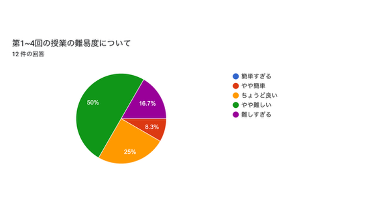
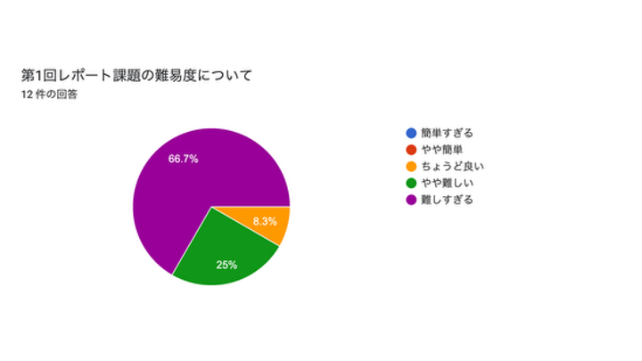

# 第1回アンケート結果

### 回答件数: 12

### 「授業に関する感想・要望」へのコメント

> 内容が比較的興味深くて楽しめる

ありがとうございます。

> 他の授業と比べて難しく感じる。あまり触れたことのない分野だからかもしれない。

最初は取っ付きにくく、難しく感じると思います。授業内外でも質問対応をしていますので、分からないことがあれば、どんどん尋ねてください。

> 質問もしやすい環境でわからないことはすぐ解決できるのがありがたかったです。

ありがとうございます。

> 一回の授業時間でちょうど終わるくらいの量のため、ちょうどいい難易度だと思います。

ありがとうございます。皆さんの進捗状況を見て、演習のスケジュールを調整することも考えているので、もし分量が多いと感じたらその旨ご連絡ください。

### 「レポート課題に関する感想・要望」へのコメント

> 内容自体は今後も役に立つ、とても興味深いものだと感じた。しかし、第1回目にしては自分にとっては難易度が高く、容量が多かった気もする。

ぜひ、今後いろいろなところで役立ててもらえればと思います。容量が多いとのことで、次回は少し分量を減らそうと思います。

> 数式入力はもちろん、グラフの挿入や、参照の方法など、色々な機能を使えたので、LaTexのいい練習になったと思います。LaTexでの文書作成に慣れれば、実験レポートなどの作成が、Wordを使うよりも早くなりそうだと思いました。

ぜひLaTeXを使いこなしてください！

> 最後の数学の問題が難しい。授業で習うことと関係がない。

LaTeXの練習を兼ねた計算問題だったのですが、難しかったかもしれません。すみません...。

> 正直とても大変に感じた。

授業でもアナウンスしているように、レポート課題に関する質問（特にコンパイルエラーやデバッグ）も受付ますので、困ったことがあれば遠慮なく質問してください。授業中でも授業後でもOKです。

> まだまったく慣れていないので、グラフ作成の部分でエラーが出まくって苦労しました。最後の問４では、数式をたくさん打ち込むので数式の打ち方のいい練習になりました。

一発でエラーのないコードを書くことはとても難しいです。エラーがたくさん出ると精神的にも疲れますよね。コーディングにエラーとデバッグは付きものなので、徐々に慣れていってもらえると嬉しいです。
数式の打ち込み練習になったようなら良かったです。

> 分量が多すぎる

すみません...。

> 今までLatexを使ったことがなく、Latexを使った授業も一度だけのため、問題を解く以前にかなりの時間がかかりました。
授業で行う内容のように、Latexの使い方やこれからLatexを使っていく上で便利なコマンドの練習などをレポートにしてほしいです。
また、第一回課題は慣れずにどうしても汚いレポートになってしまうので、今後の参考になるように模範解答のソースファイルを出してほしいです。

ご意見ありがとうございます。コマンドの練習をレポートに、というのは結構難しいかもしれませんが、授業中の演習内容がレポート課題の準備になるような設計にしていこうと思います。
最初から綺麗なレポート、プログラムを書くのは難しいので、まずはコンパイルが通る、正しい答えが出るコードを作ることから目指してもらえたら全く問題ないです。模範回答については少し検討させてください。

> とても１人でできる内容ではない
かなり難しい　５０時間かかった
無理すぎる　もう少し難易度を考えてほしい

すみません...。困ったことがあれば、遠慮なくご質問ください。

> ４の問題はコード以前に問題が難しく、ちゃんと解くことができなかった。

失礼しました。誘導を丁寧につけたつもりだったのですが、これは出題者の驕りですね。

> こなすべきタスクがかなり多く、負担は大きく感じた

レポート課題についても、授業内外でサポート可能ですので、気軽に質問してください。
