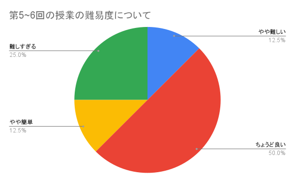
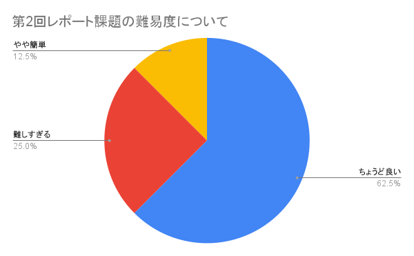

# 第2回アンケート結果

### 回答件数: 8

### 「授業に関する感想・要望」へのコメント

> 問題を感じていません．git mergeコマンドを毎回忘れるのでメモをするようにしました．このコマンドの意味もいつか学べればいいなと思います．

まず、`git fetch` を実行すると、リモートリポジトリで更新された内容（その日に新しく配布された演習資料など）がローカルにダウンロードされます。 ただし、この段階では更新内容は `.git` というディレクトリの内部に取り込まれただけで、作業ディレクトリには反映されていません（`.git` ディレクトリは、`compphys2` の直下で `ls -la` すると確認できます）。したがって、`git fetch` の直後に `ls` などでファイルを確認しても、新しい授業資料はまだ見えません。
その後、`git merge` を実行すると、`git fetch` しておいた更新内容が作業ディレクトリに反映され、初めてファイルとして確認できるようになります。
興味があれば、第4回の演習資料に載せている参考文献などを見てもらえると嬉しいです。

> 特にわかりにくかったり困ったりといったことはなく、今のように授業が進んでいくのがちょうどいいと思います。これは個人的な意見になりますが、Python関しては結構深く学びたいので、もう少し深い領域まで授業に入っていると嬉しいですね。

ありがとうございます。
現状、授業の難易度について「難しすぎる」という声も聞かれるので、さらに深い内容まで盛り込むのは少し難しいかもしれません。
お手数をおかけしますが、「もう少し深い領域」について、具体的にどんな内容に興味があるのか、次回以降のアンケートで簡単に書いてもらえると大変参考になります。よろしくお願いします。

### 「レポート課題に関する感想・要望」へのコメント

> 前回に比べて簡単になったと思います．自分はPythonを触るのが初めてだったので不安でしたが，そんな自分でも取り組みやすくかなり親切だと感じました．ほぼ詰まることもなかったのでありがたいです．

> 第１回よりも難易度、分量共にちょうど良いものになったと感じます。

> 第1回レポート課題のボリュームがかなり大きくてきつかったのに対して、第2回は1回分のレポート課題としてちょうどよい量でした。内容もそこまで難しくなく、ほどよく解き進めていけるレポートでした。

良かったです。今後のレポートはもう少しだけボリュームアップするかもしれません。授業内容の復習として、授業で出した演習課題の一部をレポート課題にする、などを考えています。

### 「自由記述欄」へのコメント

> 今更ながら少し気になったのは、毎回授業資料の差分をgithubのリモートブランチからローカルへ反映するのにgit pullを使うのってよくなかったりしますかね。
(差分反映はシェルスクリプトで自動化しているのですが、git pullを実行するようにしています。)

`git pull`は`git fetch`と`git merge`を行うコマンドで、この授業に限って言えば、どちらを使ってもらっても支障はありません。ただし、例えば将来共同開発などをする時には、少し注意した方が良いと思います。その理由は、`git fetch`後に`git merge`したいとは限らないから、です。そのため、普段から`git pull`ではなく、`git fetch`と`git merge`を使った方が良い、という意見の人もいます。