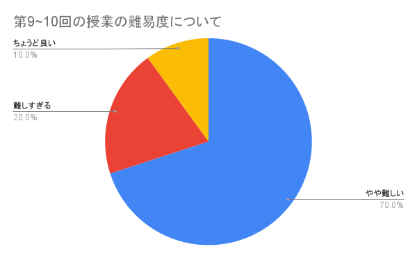
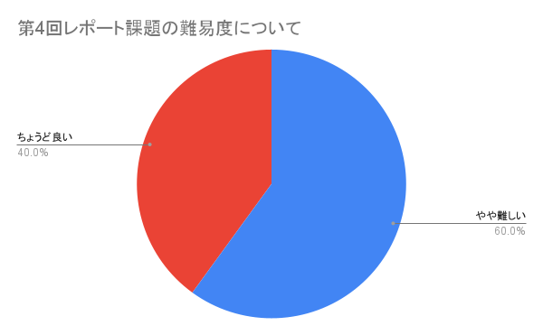

# 第4回アンケート結果

### 回答件数: 10

### 「授業に関する感想・要望」へのコメント

> 複雑なコードが多くて、正直あまり理解しきれませんでした。もっと色々コードを作って、慣れていきたいと思います。

最後の2回の演習ではコードの分量も多く、大変だったと思います。
いただいたコメントは、次年度以降の演習設計に反映させていきたいと思います。

### 「レポート課題に関する感想・要望」へのコメント

> 授業と被っている内容だったので、３が少し難しかったですが、いい演習になりました。モノクロ画像のデータ圧縮が出来るのは驚きでした。

良い演習になったようなら何よりです！

### 「自由記述欄」へのコメント

> pythonコードを用いた数値計算について体系的に学べて力がついた感覚があります。特異値分解を利用して画像を圧縮するというセクションにかなり興味をそそられました。計算物理学１では内容がかなり物理寄りだったのに対して、計算物理学２はどちらかというと計算機寄りの内容だったため、新鮮な気持ちで楽しく課題に取り組めました。

興味を持ってもらえたようで嬉しいです。

> 1年間お世話になりました。

お疲れ様でした。

> 機械関係が苦手で結構かなり苦戦したのですが、わかるようになって作業するのがとても楽しく感じられ、今後も学びたいと思いました。

初めてだと、ターミナルを経由して色々と作業するのもストレスに感じたかもしれません。
作業が楽しいと感じられるようになって良かったです。
引き続き頑張ってみてください。

> minipage環境でcaptionの位置や画像間の空白の大きさを調節する方法を調べ、出てきた\setlength\floatsep{0pt}や\setlength\textfloatsep{0pt}等のコマンドを入力しても実行できませんでした。今後のためにやり方を教えていただけないでしょうか。

`compphys2/intro_latex/introduction_latex.pdf`のセクション6を更新し、`minipage`の使い方を載せておきました。参考にしてみてください。[ここからも飛べます](../../intro_latex/introduction_latex.pdf)。

> ありがとうございました。全体を通して難しかったですが、かなり力がつきました。

授業の難易度が高いという声が多く聞かれたので、皆さんのご意見を次年度以降の演習設計に反映させていこうと思います。貴重なご意見、ありがとうございます！
